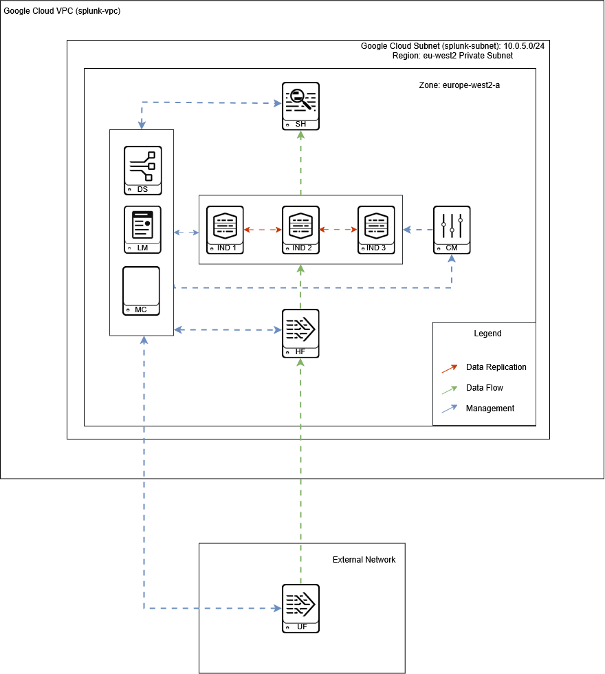

# Install and Configure Splunk on Google Cloud Platform using Terraform

This project uses Terraform to create virtual instances in GCP and to install and configure Splunk in a distributed environment.
It also includes three optional add-ons that can be installed and configured manually.

## Prerequisites

1. Create a Google Cloud Account.
2. Create a GCP Project.
3. Install the [Google CLI](https://cloud.google.com/sdk/docs/install).
4. Install [Terraform](https://developer.hashicorp.com/terraform/install).

## Getting Started

1 - Clone the repo.
```bash
git clone https://github.com/PedroPinheiro96/terraform-gcp-splunk/
```
2 - Create a new GCP project.

3 - Create a Service Account:
  - In the Google Cloud Console, go to IAM & Admin > Service Accounts
  - Create a new service account
  - Assign the following roles:
     - Compute Admin (https://cloud.google.com/iam/docs/roles-permissions/compute#compute.admin)
     - Compute Network Admin (https://cloud.google.com/iam/docs/roles-permissions/compute#compute.networkAdmin)
     - Quota Administrator (https://cloud.google.com/iam/docs/roles-permissions/servicemanagement#servicemanagement.quotaAdmin)
     - Service Account User (https://cloud.google.com/iam/docs/roles-permissions/iam#iam.serviceAccountUser)
       See [more roles](https://cloud.google.com/iam/docs/roles-permissions)) and [best practices](https://cloud.google.com/iam/docs/best-practices-service-accounts)
 
4 - Create a Service Account Key.
  - Click on the service account.
  - Go to the the Keys tab.
  - Click Add key > Create private key.
  - Choose JSON, then click Create.
  - Create a credentials directory in the root of the project.
  - Save the key in the credentials directory and update the path in terraform.tfvars.
    
5 - Configure gcloud to use the service account
  - Authenticate the service account:
    ```bash
    gcloud auth activate-service-account --project=PROJECTID --key-file /path/to/file
    ```
  - Activate the account (if needed):
    ```bash
    gcloud config set account 'ACCOUNT'
    ```
  - Run the following command to confirm if the correct account is active:
    ```bash
    gcloud auth list
    ```
    
6 - Initialize Terraform
```bash
cd terraform-gcp-splunk/ && terraform init
```

7 - Create terraform.tfvars in the root of the project.
Replace with your own values:
```text
project_id         = "PROJECT ID"
serviceAccount_key = "credentials/<KEY NAME>"
pubIP              = ["YOUR PUBLIC IP"] #For access to Splunk Web and UF firewall configuration.
serviceAccount     = "SERVICE ACCOUNT EMAIL"
sshKey             = "Service Account SSH KEY" #For SSH access to the Splunk Servers
```
8 - Update the Splunk license in the splunk_install_ds.sh script.

9 - Run terraform
```bash
terraform plan
terraform apply
```
Respond with yes when prompted.
    
10 - To view the status of the installation script, SSH into the instance and run:
```bash
sudo journalctl -f -u google-startup-scripts.service
```

11 - Access the Deployment Server GUI:
   - Go to Settings > Monitoring Console.
   - Go to Settings > General Setup.
   - Select Distributed Mode and click Apply.
   - Role assignments are handled by the installation script.

12 - Transfer the add-ons from terraform-gcp-splunk/apps/ to the deployment-apps directory on the Deployment Server.

13 - Manually configure:
   - Microsoft Cloud Services add-on inputs.
   - CIM add-on macros
   - Enable the DM acceleration.

14 - Optional (Windows VM + Universal Forwarder): 
   - This project also uses a Windows VM outside Google Cloud. 
   - Install and configure the Universal Forwarder as a Deployment Client. Open ports 9997 and 8089 on the firewall. The Deployment Server is configured to do the rest.
   - Update the HF IP in deployment-apps/UFConfig/local/outputs.conf (or in splunk_install_ds if you have a static IP). This add-on is deployed to the Universal Forwarder and tells it where to forward data to.
   - Configure TLS
    - Web:
      - Create a [self-signed certificate](https://docs.splunk.com/Documentation/Splunk/9.4.2/Security/Howtoself-signcertificates).
      - On servers with Web UI enabled:
        ```bash
        nano /opt/splunk/etc/system/local
        
        Add the following:
        [settings]
        privKeyPath = <path to private key>
        serverCert = <path to cert>
        sslRootCAPath = <path to Root CA>
        sslPassword = <private key Password>
        ```
  - Splunk to Splunk TLS (On all Splunk servers):
        ```bash
        [sslConfig]
        enableSplunkdSSL = true
        sslRootCAPath = <path to Root CA>
        serverCert = <path to cert>
        sslPassword = <private key Password>
        ``` 
          `( "enableSplunkWebSSL=true" already enabled through the Deployment Server)`

## Environment Overview After Deployment

<p align="center">
  "
</p>

- All Splunk servers are connected as Deployment Clients (Apart from the Indexers - They are managed by the Cluster Manager. The Universal Forwarder is configured to connect to the DS during the manual installation of the Universal Forwarder).
- The Splunk license is installed on the Deployment Server.
- Deployment Server acts as the License Manager and Monitoring Console.
- All servers are using the Deployment Server as the License Manager.
- The Deployment Server distributes Windows Security inputs to the Universal Forwarder.
- Splunk instances are added as search peers to the Deployment Server.
- Monitoring Console is configured in distributed mode on the Deployment Server, with the appropriate roles for each Splunk instance (Enable it manually. There's no current way of enabling distributed mode through configuration files).
- Indexer discovery is enabled.
- The Indexer Cluster is configured with replication factor 3 and search factor 2.
- Outputs.conf configured locally on the Heavy Forwarder. If the configuration is deployed through the Deployment Server, the key in deployment-apps won't be hashed. (Please fix this Splunk!) 
- The Universal Forwarder is configured to send logs to the Heavy Forwarder (remember to update the HF IP in deployment-apps/UFConfig/local/outputs.conf).
- The Heavy Forwarder receives and parses logs from the Universal Forwarder and forwards it to the Indexer Cluster using Indexer Discovery.
- Google Cloud firewall configured to allow access to the Webpage of the Splunk servers from a single public IP only (configured in terraform.tfvars).
- UFW configured on each host to allow the necessary splunk ports to function as expected.
- The Web server of the Indexers is disabled. 
- 3 Indexes are created: prod_azure, prod_defender, prod_windows.
- 3 user roles are also created: soc_analyst, soc_engineer and manager.

## Future Improvements

- Integrate Google Secrets Manager to securely manage sensitive credentials and configuration secrets.
- Harden firewall rules by allowing only the necessary ports per server, both at the GCP and UFW levels.
- Automate the download and deployment of Splunk apps to reduce manual steps and ensure consistency.
- Automate TLS certificate generation and configuration across all relevant Splunk components.

## Resources

- To learn more about provisioning GCP resources with Terraform:
  - [Terraform and GCP Overview](https://cloud.google.com/compute/docs/terraform)
  - [Terraform Documentation](https://developer.hashicorp.com/terraform)
  - [Google Provider for Terraform](https://registry.terraform.io/providers/hashicorp/google/latest/docs)
